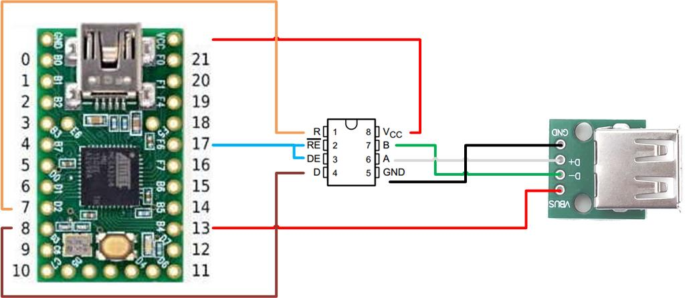
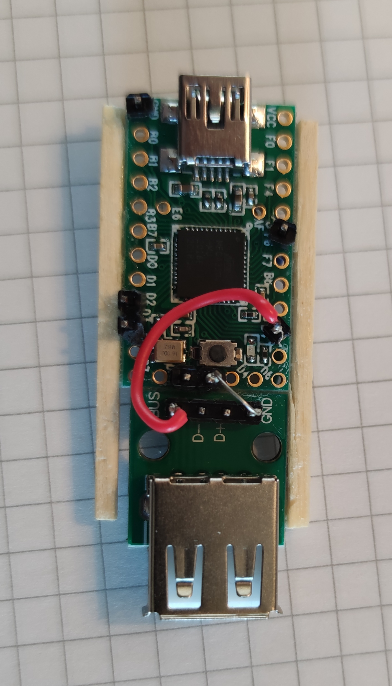

# JVS2X
 <h2>Introduction </h2>
 This project aims to use Home consoles or PC's in an arcade CAB.
  It acts as an interface between the host and the Arcade IO Board, converting JVS protocol to USB (software HID Device).
  The host (home console/PC) will detect it as a compatible game controller/Keyboard. 
  
  The Device Controller has 3 HID interfaces; 2 gamepads + 1 debug. In other words, it 'emulates' 2 gamepads.
  Here are the systems compatible as of today:
  &nbsp&nbsp&nbsp-&nbspSony Plastation 3 (Home button supported: 'Start + Button 1')
  &nbsp&nbsp&nbsp-&nbspMicrosoft Windows
  &nbsp&nbsp&nbsp-&nbspLinux
  &nbsp&nbsp&nbsp-&nbspApple
  
  TODO: Implement HID for PS4, XBOX One, etc. :) 
   
  This project is highly inspirated from other projects referenced at the bottom of this page.
  Do not hesitate to look at these projects to have more information.
   
  
<h2>Building the hardware</h2>
  Here are the components you need to construct your adapter (total max. 15€):
   
 
Please follow this diagram for soldering:

It could look approximatelly like this:
<table>
<td></td>
<td></td>
</table>
There are also additional pictures from other realisations in the doc folder if needed.

<h2>Building the software</h2>
 For now on, I use VS Code with PlatformIO IDE extension:
  &nbsp&nbsp&nbsp-&nbspBoard: Teensy 2.0
  &nbsp&nbsp&nbsp-&nbspFramework: Arduino
  You don't have to compile it, there is already a compilted version in 'build' folder
  
 <h2>Upload software</h2>
 Please upload 'ps3_pc_mac_generic_gamepad.hex' in your Teensy with help of Teensy Loader (c/o pjrc.com).
  
 
 <h2>Compatibilty list</h2>
Here are some games confirmed to work on Sony Playstation 3:
 &nbsp&nbspWorking:
 &nbsp&nbsp&nbsp-&nbspUnder defeat HD
 &nbsp&nbsp&nbsp-&nbspRayStorm HD
 &nbsp&nbsp&nbsp-&nbspSuper Street Fighter IV Arcade Edition
 &nbsp&nbsp&nbsp-&nbspVirtua Fighter 5 
 &nbsp&nbsp&nbsp-&nbspSöldner-X 2
 &nbsp&nbsp&nbsp-&nbspSuper Street Fighter ii Turbo HD Remix
 &nbsp&nbsp&nbsp-&nbspR-Type Dimensions
 &nbsp&nbsp&nbsp-&nbspMetal Slug 2 
 &nbsp&nbsp&nbsp-&nbspCapcom Arcade Cabinet (Ghodtd'n goblins, Commando, Gun Smoke, section7, etc.)
 &nbsp&nbsp&nbsp-&nbspSky force Anniversary
 &nbsp&nbsp&nbsp-&nbspAfter burner 
 &nbsp&nbsp&nbsp-&nbspSonic generations 
 &nbsp&nbsp&nbsp-&nbspWipeOut HD Fury
 
<h2>Controller mapping</h2>
 Some PS3 buttons do not exist on a arcade control panel. These are mapped as follow:
 &nbsp&nbsp&nbsp-&nbspSTART + Button 1 -> PS Button
 &nbsp&nbsp&nbsp-&nbspSTART + Button 2 -> Select
 

<h2>Fault tolerance</h2>
 There is no special order to follow when starting your equipment, all orders are supported.
  
 JVS2X will detect these follow errors and act uppon:
 &nbsp&nbsp&nbsp-&nbspJVS cable removed &nbsp&nbsp&nbsp&nbsp&nbsp&nbsp&nbsp&nbsp&nbsp-> JVS2X will wait for JVS cable and reinitialize when detected
 &nbsp&nbsp&nbsp-&nbspJVS IO Board powered off&nbsp&nbsp&nbsp -> JVS2X will wait for JVS IO Board powered on again and reinitialize when detected
 &nbsp&nbsp&nbsp-&nbspPS3 Powered off and on again -> JVS2X is also powered off and on as it is powered by the PS3 USB.
 
 If for any reason, you have the impression that JVS2X is blocked or not respondiging accordingly, you can always try to restart it by pressing these 3 buttons at the same time: START + Button 1 + Button 2 -> Restart JVS2X

 <h2>External references</h2>
 This project is based on:
  &nbsp&nbsp&nbsp-&nbspJVSy from k4roshi (https://github.com/k4roshi/JVSy)., 
  &nbsp&nbsp&nbsp-&nbspAdapted version of JVSy (https://github.com/gtranche/JVSy).
  &nbsp&nbsp&nbsp-&nbspOpenJVS (https://github.com/OpenJVS/OpenJVS).
  
   Many thanks for sharing all these precious sources of information and also a special thanks to Bobby for all his help, ideas and support!
   
   Have fun & best regards.
   Fred
