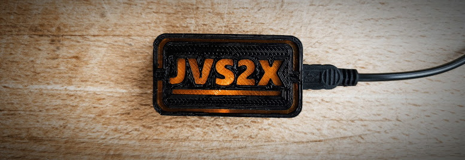
 <h2>Introduction </h2>
 I was not really in favor of integrating Gaming consoles in arcade CABs but I gave a try with a Sony Playstation 3 and could confirm that:
  &nbsp&nbsp&nbsp-&nbspIt can natively output 640x480@60Hz with 4:3 aspect ratio (not all games)
  &nbsp&nbsp&nbsp-&nbspIt natively supports Logitech G25 racing Wheel with full FFB and has some excellent arcade ports (i.e. OutRun 2 SP, Sega Rally, GTI Club)
  &nbsp&nbsp&nbsp-&nbspIt can run arcade Shoot'em ups (i.e. RayStorm HD) and Beat'em ups (i.e. Street Fighter IV Arcade Edition)
  &nbsp&nbsp&nbsp-&nbspIt could be an excellent solution for rail shooting games with also very interesting arcade ports
  
  For the racing games, it was not a problem as I could directly connect my racing wheel but I needed an interface for being able to play other games with my CAB's controller. 
   -> I decided to use a Teensy 2.0 for this purpose as already done by other users but with small changes to fit my needs. 
   
  JVS2X (Teensy) acts as an interface between the Game console/PC and the Arcade JVS IO Board, converting JVS protocol to USB (software HID Device). 
  When compiled in JVS2PS3 mode, the Teensy will represents a USB composite Device exposes 2 HID interfaces of type gamepad controllers.
  When compiled in JVS2KEYBOARD mode, the Teensy will represents a USB composite Device exposes 2 HID interfaces of type Keyboard. 
  
  Here is a non exhaustive list of systems that should be compatible today when compiled in JVS2PS3 mode (TBC):
  &nbsp&nbsp&nbsp-&nbspSony Playstation 3 (Home button supported: 'Start + Button 1')
  &nbsp&nbsp&nbsp-&nbspMicrosoft Windows (i.e. Mame)
  &nbsp&nbsp&nbsp-&nbspLinux based systems (i.e. RetroPie)
  &nbsp&nbsp&nbsp-&nbspNintendo Switch 
  &nbsp&nbsp&nbsp-&nbspEtc.
  
  This project is not something new; it is highly inspired from other projects referenced at the bottom of this page.
  Do not hesitate to look at these projects to have more information.
  
  What could be considered as new here, is the way it is implemented (technical aspects):
  &nbsp&nbsp&nbsp-&nbspBulk JVS Commands dynamically built based on supported JVS client features
  &nbsp&nbsp&nbsp-&nbspAnalog and LightGun support
  &nbsp&nbsp&nbsp-&nbspDaisy chain support
  &nbsp&nbsp&nbsp-&nbspConfigurable multi CABs
  &nbsp&nbsp&nbsp-&nbspOptimized USB report updates
  &nbsp&nbsp&nbsp-&nbspBasic Analog Fuzz filters
  &nbsp&nbsp&nbsp-&nbspController remapping facilities
  &nbsp&nbsp&nbsp-&nbsp2 keyboards interfaces to circumvent limitation of 8 keystrokes (6 non-modifier keycodes + 2 modifiers) per Keyboard report (=> 2x 6KRO).
  &nbsp&nbsp&nbsp-&nbspSupport multi Keyboard layout
  &nbsp&nbsp&nbsp-&nbspSupport for programmable shiftKeys
  &nbsp&nbsp&nbsp-&nbspEtc. 
   
  Here is a video of a PS3 in an arcade CAB with Logitech G25 Racing Wheel (FFB full support natively) :
  
  
  Here is another video of a PS3 in an arcade CAB but this time with a JVS2X adapter connected to JVS IO Board (for 'sticks' games) :
  
  
  
  
  TODO: Implement HID for PS4, XBOX One, etc. when I have time or with your help :) 
 
<h2>Supported arcade layout</h2>
JVS2X is developed to support device chaining, thus it supports multiple JVS IO boards in the same CAB or in different CABs (Clone mode, VS mode, etc.)
 All is implemented but I can't test as I do only have 1 CAB :( 
 If someone is willing to give it a try, I will be more than happy to help in case of trouble
 
 You can configure your CAB's layout by updating file jvs_host_config.h:
 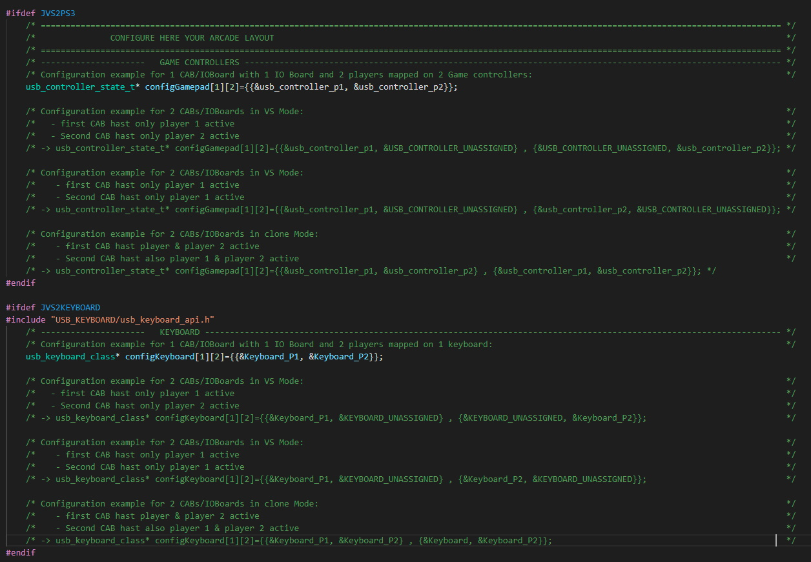 

<h2>Building the hardware</h2>
Here are the components you need to construct your adapter (total max. 15€):
   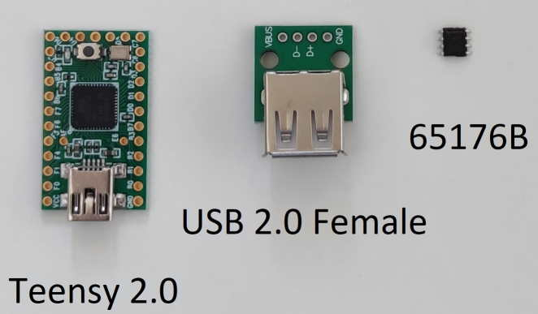

Then, you have the possibility to buy a pcb helper for a very reasonable from Aganyte (easy way):
<table>
<td>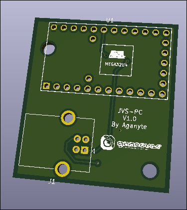</td><td>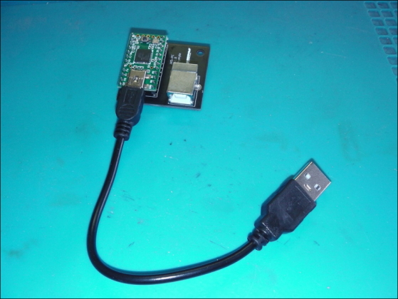</td>
</table>
more information at https://www.gamoover.net/Forums/index.php?topic=43288.0

 And for the courageous one, here is diagram for soldering all yourself without the Aganyte's PCB (hardcore way):
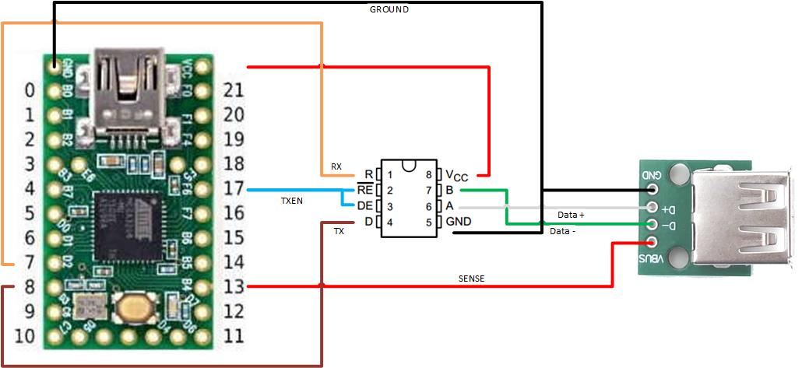

This is the way I soldered mine (c/o compatible enclosure below if needed):
<table>
<td>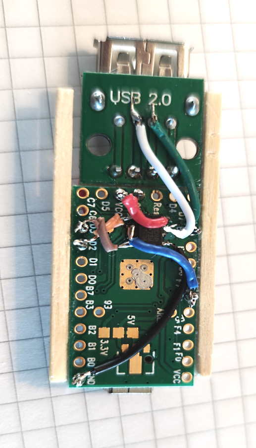</td>
<td>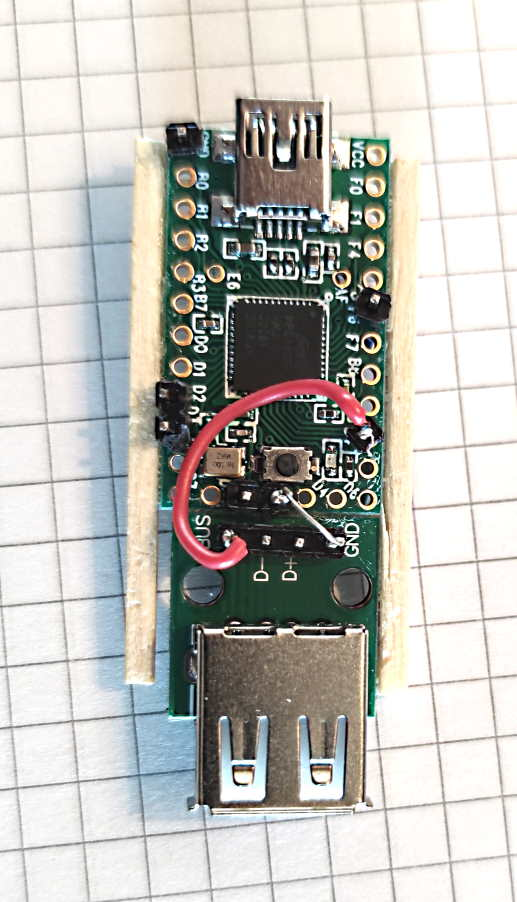</td>
</table>
There are also additional pictures from other realizations for other persons, in the doc folder if needed.

<h2>Printing an enclosure</h2>
I also designed a box for the JVS2X:
<table>
<tr><td colspan="2">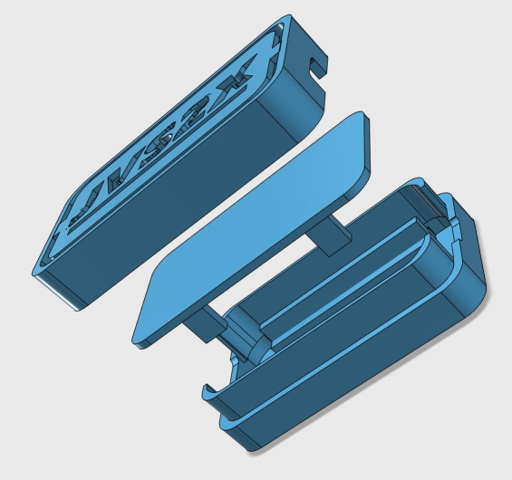</td></tr>
<tr><td>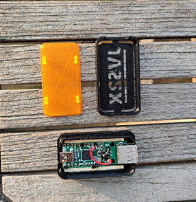</td><td>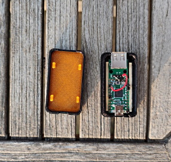</td></tr>
</table>
In case you are interested, You can find the 3 STL files in the 'Enclosure' folder.

<h2>Compiling the software</h2>
 For now on, I use VS Code with PlatformIO IDE extension:
  &nbsp&nbsp&nbsp-&nbspBoard: Teensy 2.0
  &nbsp&nbsp&nbsp-&nbspFramework: Arduino
  Here are the supported build flags (c/o platformio.ini):
  <table>
 <TD>&nbsp&nbsp&nbsp-&nbspJVS2PS3</td><td> -> create 2 gamepad controllers compatible with ps3, pc, etc.</td><tr>
 <TD>&nbsp&nbsp&nbsp-&nbspJVS2KEYBOARD</td><td> -> create 2 keyboards</td><tr>
 <TD>&nbsp&nbsp&nbsp-&nbspJVSDEBUG=1</td><td> -> activate info traces</td><tr>
 <TD>&nbsp&nbsp&nbsp-&nbspJVSDEBUG=2</td><td> -> activate debug traces</td><tr>
 <TD>&nbsp&nbsp&nbsp-&nbspLAYOUT_FRENCH_BELGIAN</td><td> -> set keyboard layout to French for Unicode keyboard mapping</td><tr>
 <TD>&nbsp&nbsp&nbsp-&nbspSENSE_DISABLED</td><td> -> disable sense line</td><tr>
 <TD>&nbsp&nbsp&nbsp-&nbspSHIFTKEY_DISABLED</td><td> -> disable keyboard shift keys support</td><tr>
  </table>
  If you don't want to compile it, there is already a compiled version in 'build' folder
  
 <h2>Upload software</h2>
 Please upload 'jvs2x.hex' in your Teensy with help of Teensy Loader (c/o pjrc.com).
  
 
 <h2>Debugging</h2>
You can compile JVS2X with JVSDEBUG flag; this will create a additional HID interface that you will connect with help of hid_listen.exe (c/o https://www.pjrc.com/teensy/hid_listen.html for more information)
 
 You should see these traces:
 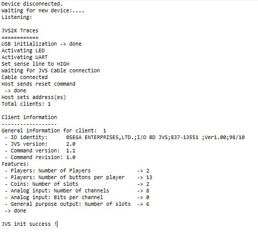
 If you do not want to compile it, I also have placed debug versions in 'build' folder too.

 <h2>LED States</h2>
JVS2X uses the Teensy internal LED to indicate several states:
 &nbsp&nbsp&nbsp-&nbspContinuously blinking: waiting for a JVS cable to be connected
 &nbsp&nbsp&nbsp-&nbspNo blink: init phase started
 &nbsp&nbsp&nbsp-&nbspSteady ON: JVS init is finished successfully and the device is ready

<h2>Compatibilty list</h2>
Here are some games confirmed to work on Sony PlayStation 3:
 &nbsp&nbspWorking:
 &nbsp&nbsp&nbsp-&nbspUnder defeat HD
 &nbsp&nbsp&nbsp-&nbspRayStorm HD
 &nbsp&nbsp&nbsp-&nbspSuper Street Fighter IV Arcade Edition
 &nbsp&nbsp&nbsp-&nbspVirtua Fighter 5 
 &nbsp&nbsp&nbsp-&nbspSöldner-X 2
 &nbsp&nbsp&nbsp-&nbspSuper Street Fighter ii Turbo HD Remix
 &nbsp&nbsp&nbsp-&nbspR-Type Dimensions
 &nbsp&nbsp&nbsp-&nbspMetal Slug 2 
 &nbsp&nbsp&nbsp-&nbspCapcom Arcade Cabinet (Ghodtd'n goblins, Commando, Gun Smoke, section7, etc.)
 &nbsp&nbsp&nbsp-&nbspSky force Anniversary
 &nbsp&nbsp&nbsp-&nbspAfter burner 
 &nbsp&nbsp&nbsp-&nbspSonic generations 
 &nbsp&nbsp&nbsp-&nbspWipeOut HD Fury
 
<h2>Controller mapping</h2>
Some PS3 buttons do not exist on a arcade control panel. These are mapped as follow:
 &nbsp&nbsp&nbsp-&nbspSTART + Button 1 -> PS Button
 &nbsp&nbsp&nbsp-&nbspSTART + Button 2 -> Select
 
  You can reconfigure the default control mapping to your likings by updating the file jvs_controller_ps3_config.h:
 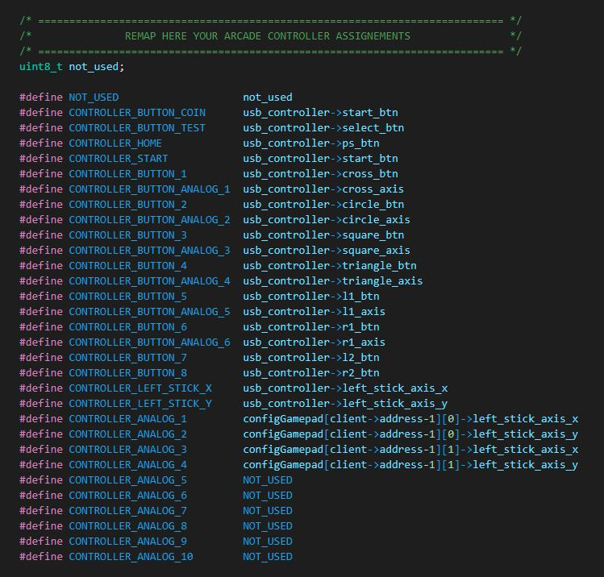

<h2>Keyboard mapping</h2>
Keyboard mapping is done by updating the file jvs_keyboard_config.h
 Keyboard mapping can be done by giving keycodes or unicodes.
 It is strongly advised that you use keycode mapping for your emulators (i.e. Mame).
 
 
  If for any reason you would still like to use unicode caracters, it is possible but you will have to select also the according keyboard layout (default is 'US'):
  The desired keyboard layout (i.e. "LAYOUT_FRENCH") must be given at compile time as parameter (c/o platformio.ini) 
 For now it supports those layouts (extract from keylayouts.h):
<TABLE> 
<TR><TD>&nbsp&nbsp- LAYOUT_US_ENGLISH          </TD><TD>&nbsp&nbsp- LAYOUT_US_INTERNATIONAL</TR>
<TR><TD>&nbsp&nbsp- LAYOUT_GERMAN              </TD><TD>&nbsp&nbsp- LAYOUT_GERMAN_MAC</TR>
<TR><TD>&nbsp&nbsp- LAYOUT_CANADIAN_FRENCH     </TD><TD>&nbsp&nbsp- LAYOUT_CANADIAN_MULTILINGUAL</TR>
<TR><TD>&nbsp&nbsp- LAYOUT_UNITED_KINGDOM      </TD><TD>&nbsp&nbsp- LAYOUT_FINNISH</TR>
<TR><TD>&nbsp&nbsp- LAYOUT_FRENCH              </TD><TD>&nbsp&nbsp- LAYOUT_DANISH</TR>
<TR><TD>&nbsp&nbsp- LAYOUT_NORWEGIAN           </TD><TD>&nbsp&nbsp- LAYOUT_SWEDISH</TR>
<TR><TD>&nbsp&nbsp- LAYOUT_SPANISH             </TD><TD>&nbsp&nbsp- LAYOUT_PORTUGUESE</TR>
<TR><TD>&nbsp&nbsp- LAYOUT_ITALIAN             </TD><TD>&nbsp&nbsp- LAYOUT_PORTUGUESE_BRAZILIAN</TR>
<TR><TD>&nbsp&nbsp- LAYOUT_FRENCH_BELGIAN      </TD><TD>&nbsp&nbsp- LAYOUT_GERMAN_SWISS</TR>
<TR><TD>&nbsp&nbsp- LAYOUT_FRENCH_SWISS        </TD><TD>&nbsp&nbsp- LAYOUT_SPANISH_LATIN_AMERICA</TR>
<TR><TD>&nbsp&nbsp- LAYOUT_IRISH               </TD><TD>&nbsp&nbsp- LAYOUT_ICELANDIC</TR>
<TR><TD>&nbsp&nbsp- LAYOUT_TURKISH             </TD><TD>&nbsp&nbsp- LAYOUT_CZECH</TR>
<TR><TD>&nbsp&nbsp- LAYOUT_SERBIAN_LATIN_ONLY  </TD><TD></TR>
<table>
 Here is an example of Keyboard mapping with unicode caracters:
 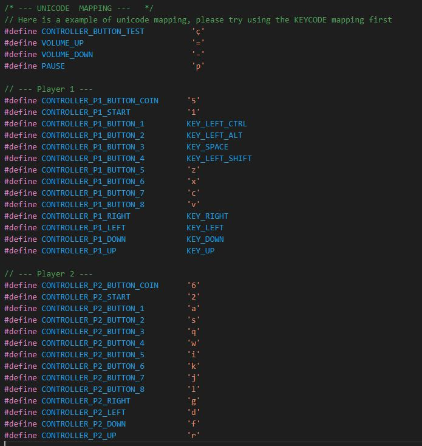 
 Please note that you can also define 'Shift Keys' in this same Keyboard configuration file:
 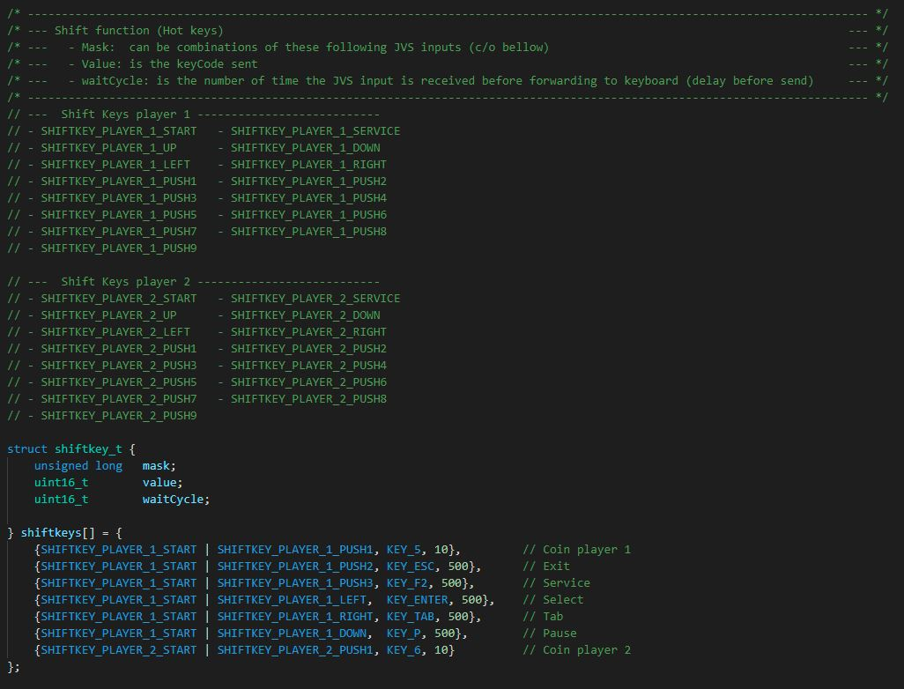 
 
<h2>Fault tolerance</h2>
There is no special order to follow when starting your JVS2X, all orders are supported.
  
 JVS2X will detect these follow errors and act upon:
 <table>
  <tr><td>&nbsp&nbsp&nbsp-&nbspJVS cable removed</td><td>-> JVS2X will wait for JVS cable and reinitialize when detected.</td></tr>
  <tr><td>&nbsp&nbsp&nbsp-&nbspJVS IO Board powered off</td><td>-> JVS2X will wait for JVS IO Board powered on again and reinitialize when detected.</td></tr>
  <tr><td>&nbsp&nbsp&nbsp-&nbspPS3 Powered off and on again</td><td>-> JVS2X is also powered off and on as it is powered by the PS3 USB.</td></tr>
  </table>
 If for any reason, you have the impression that JVS2X is blocked or not responding accordingly, you can always try to restart it by pressing these 3 buttons at the same time: START + Button 1 + Button 2 -> Restart JVS2X
<h2>Sony PlayStation 3 video output</h2>
 In my journey to integrate the Sony PS3 in my CAB, I spent several weeks finding the best way to connect the video output.
  Let me share my experience and my final implementation.
 <h3>640x480@60Hz</h3>
 The PS3 can output this resolution ONLY if the region is set to NTSC:
  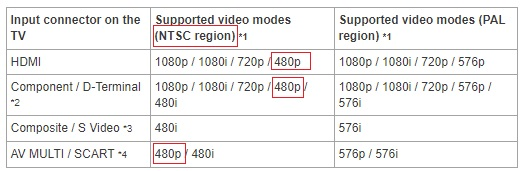
 (extract from https://manuals.playstation.net/document/en/ps3/3_15/settings/videooutput.html)
  
   -> So you have 2 choices, either you have a NTSC PS3 or you you have a PAL PS3 that you can change region with help of CFW and some registry updates.
 <h3>"VGA" cable</h3>
 Next, I had to look at the video connectivity and first tried one of those PS3 to VGA cable:
  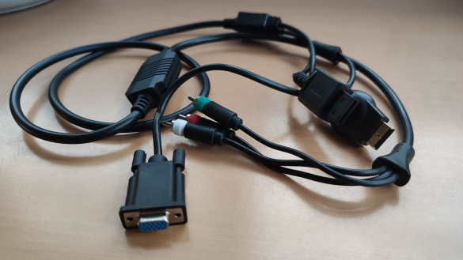 
  This was a mistake, the image was very dark, washed and colorimetry was wrong. It turned out that this was not a standard VGA output (RGB HV) but D-Terminal (Sync on Green, D2). This video format can also be found on Sony PS2 and Nintendo GameCube.  More info at https://en.m.wikipedia.org/wiki/D-Terminal.

<h3>Component out</h3>  
Then I tried the component Video out cable that I connected to my GBS Control (custom CBS 8200) configured to direct output to same resolution in VGA and surprise, it worked well!
 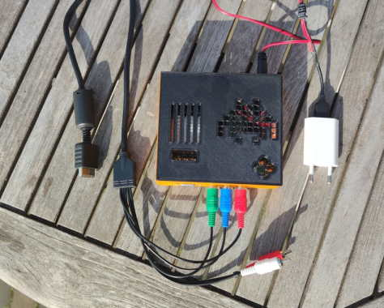 
Looking at it a bit more after some days, it was kind of working but the image was a little too blury and it was a bit overkill, no? So I decided to look at something else.

 <h3>HDMI + DAC</h3>
 I decided to give a try to this little DAC converter, after all that is what we can also find on Video cards with VGA output:
  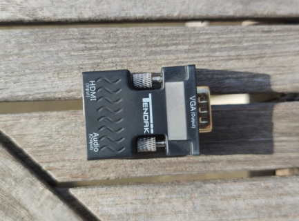  
 The result is just perfect! Image is sharp, without any lags or screen tearing, simple to use and so cheap!?! 
   -> That is my solution.
   
  Please note that this little adapter does not downscale, etc. It is just a DAC converter. So the HDMI out on PS3 is configured to output 480p.
 
 
 
<h2>External references</h2>
 This project is based on:
  &nbsp&nbsp&nbsp-&nbspJVSy from k4roshi (https://github.com/k4roshi/JVSy)., 
  &nbsp&nbsp&nbsp-&nbspAdapted version of JVSy (https://github.com/gtranche/JVSy).
  &nbsp&nbsp&nbsp-&nbspOpenJVS (https://github.com/OpenJVS/OpenJVS).
  
   Many thanks for sharing all these precious sources of information and also a special thanks to Bobby & Francesco for all thier help, ideas and support!
   
   Have fun & best regards.
   Fred
