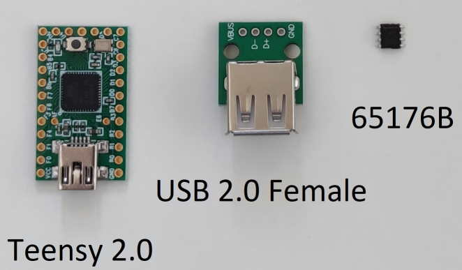
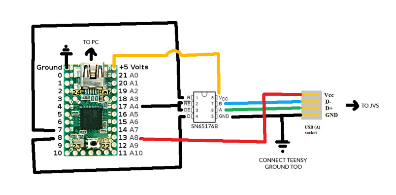

# JVS2X
 <h2>Introduction </h2>
 This project aim to use Home consoles or PC's in an arcade CAB.
  It acts as an interface between the host and the Arcade IO Board, converting JVS protocol to USB (software HID Device).
  The host (home console/PC) will detect it as a compatible game controller/Keyboard. 
    
 This project is based on https://github.com/k4roshi/JVSy, many thanks for sharing the information.
  
  
<h2>Building the hardware</h2>
  Here are the compenets you need to construct your adapter:
   
 

Please follow this diagram for soldering:

<h2>Building the software</h2>
 For now on, I use VS Code with PlatformIO IDE extension:
     - Board: Teensy 2.0
     - Framework: Arduino
  
  
 
 
