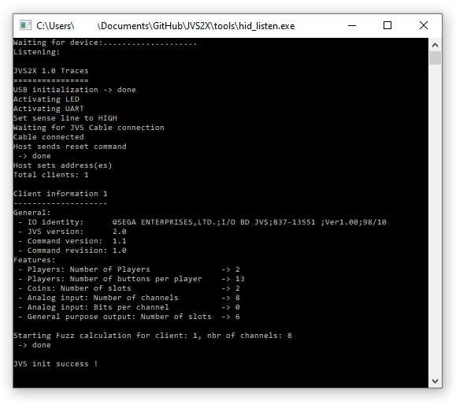
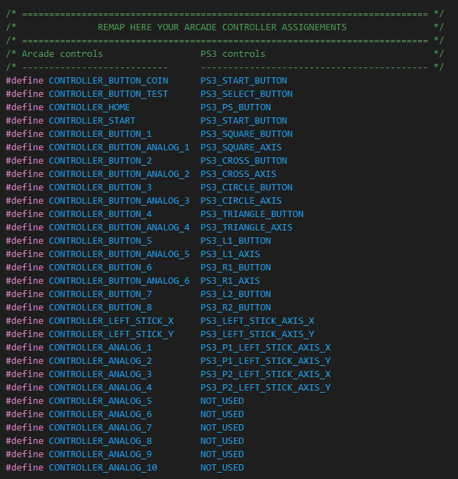

 <h2>Introduction </h2>
 This project aims to use Game consoles or PC's in an arcade CAB.
  It acts as an interface between the Game console/PC and the Arcade JVS IO Board, converting JVS protocol to USB (software HID Device).
  The Game console/PC will detect it as 2 compatible game controllers. 
  This USB composite Device exposes 3 HID interfaces: 2 gamepad controllers + 1 debug. HID
  
  Here are the systems compatible as of today in 'JVS2PS3' mode:
  &nbsp&nbsp&nbsp-&nbspSony Playstation 3 (Home button supported: 'Start + Button 1')
  &nbsp&nbsp&nbsp-&nbspMicrosoft Windows (i.e. Mame)
  &nbsp&nbsp&nbsp-&nbspLinux based systems (i.e. RetroPie)
  &nbsp&nbsp&nbsp-&nbspApple
  &nbsp&nbsp&nbsp-&nbspNintendo Switch 
  &nbsp&nbsp&nbsp-&nbspEtc.
  
  This project is not something new; it is highly inspirated from other projects referenced at the bottom of this page.
  Do not hesitate to look at these projects to have more information.
  
  What could be considered as new here, is the way it is implemented (technical aspects):
  &nbsp&nbsp&nbsp-&nbspBulk JVS Commands dynamically built based on supported JVS client features
  &nbsp&nbsp&nbsp-&nbspAnalog and LightGun support
  &nbsp&nbsp&nbsp-&nbspDaisy chain support
  &nbsp&nbsp&nbsp-&nbspConfigurable multi CABs
  &nbsp&nbsp&nbsp-&nbspOptimized USB report updates
  &nbsp&nbsp&nbsp-&nbspBasic Analog Fuzz filters
  &nbsp&nbsp&nbsp-&nbspController remapping facilities
  &nbsp&nbsp&nbsp-&nbspEtc. 
  
  TODO: Implement HID for PS4, XBOX One, etc. when I have time or with your help :) 
 
<h2>Supported arcade layout</h2>
JVS2X is developed to support device chaining, thus it supports multiple JVS IO boards in the same CAB or in different CABs (Clone mode, VS mode, etc.)
 All is implemented but I can't test as I do only have 1 CAB :( 
 If someone is willing to give it a try, I will be more than happy to help in case of trouble
 
 You can configure your CAB's layout by updating file jvs_host_config.h:
  

<h2>Building the hardware</h2>
As said, this project is based on other projects which use the same hardware and soldering. 
 Here are the components you need to construct your adapter (total max. 15€):
   
 
Please follow this diagram for soldering:

This is the way I soldered mine (c/o compatible enclosure below if needed):
<table>
<td></td>
<td></td>
</table>
There are also additional pictures from other realizations for other persons, in the doc folder if needed.

<h2>Printing an enclosure</h2>
I also designed a box for the JVS2X:
<table>
<tr><td colspan="2"></td></tr>
<tr><td></td><td></td></tr>
</table>
In case you are interested, You can find the 3 STL files in the 'Enclosure' folder.

<h2>Compiling the software</h2>
 For now on, I use VS Code with PlatformIO IDE extension:
  &nbsp&nbsp&nbsp-&nbspBoard: Teensy 2.0
  &nbsp&nbsp&nbsp-&nbspFramework: Arduino
  If you don't want to compile it, there is already a compiled version in 'build' folder
  
 <h2>Upload software</h2>
 Please upload 'jvs2x.hex' in your Teensy with help of Teensy Loader (c/o pjrc.com).
  
 
 <h2>Debugging</h2>
You can compile JVS2X with DEBUG flags by for instance, update the platformio.ini like this:
 "build_flags = -D USB_DISABLED -D JVSDEBUG=1 -D TARGET=JVS2PS3"
 
 On the debug terminal (c/o hid_listen.exe used for Teensy), you should see these traces:
 <<
 
 >>
 If you do not want to compile it, I also have placed debug versions in 'build' folder too.

 <h2>LED States</h2>
JVS2X uses the Teensy internal LED to indicate several states:
 &nbsp&nbsp&nbsp-&nbspContinuously blinking: waiting for a JVS cable to be connected
 &nbsp&nbsp&nbsp-&nbspNo blink: init phase started
 &nbsp&nbsp&nbsp-&nbspStaidy ON: JVS init is finished succesfully and the device is ready

<h2>Compatibilty list</h2>
Here are some games confirmed to work on Sony Playstation 3:
 &nbsp&nbspWorking:
 &nbsp&nbsp&nbsp-&nbspUnder defeat HD
 &nbsp&nbsp&nbsp-&nbspRayStorm HD
 &nbsp&nbsp&nbsp-&nbspSuper Street Fighter IV Arcade Edition
 &nbsp&nbsp&nbsp-&nbspVirtua Fighter 5 
 &nbsp&nbsp&nbsp-&nbspSöldner-X 2
 &nbsp&nbsp&nbsp-&nbspSuper Street Fighter ii Turbo HD Remix
 &nbsp&nbsp&nbsp-&nbspR-Type Dimensions
 &nbsp&nbsp&nbsp-&nbspMetal Slug 2 
 &nbsp&nbsp&nbsp-&nbspCapcom Arcade Cabinet (Ghodtd'n goblins, Commando, Gun Smoke, section7, etc.)
 &nbsp&nbsp&nbsp-&nbspSky force Anniversary
 &nbsp&nbsp&nbsp-&nbspAfter burner 
 &nbsp&nbsp&nbsp-&nbspSonic generations 
 &nbsp&nbsp&nbsp-&nbspWipeOut HD Fury
 
<h2>Controller mapping</h2>
Some PS3 buttons do not exist on a arcade control panel. These are mapped as follow:
 &nbsp&nbsp&nbsp-&nbspSTART + Button 1 -> PS Button
 &nbsp&nbsp&nbsp-&nbspSTART + Button 2 -> Select
 
  You can reconfigure the default control mapping to your likings by updating the file jvs_controller_ps3_config.h:
 

<h2>Fault tolerance</h2>
There is no special order to follow when starting your JVS2X, all orders are supported.
  
 JVS2X will detect these follow errors and act upon:
 <table>
  <tr><td>&nbsp&nbsp&nbsp-&nbspJVS cable removed</td><td>-> JVS2X will wait for JVS cable and reinitialize when detected.</td></tr>
  <tr><td>&nbsp&nbsp&nbsp-&nbspJVS IO Board powered off</td><td>-> JVS2X will wait for JVS IO Board powered on again and reinitialize when detected.</td></tr>
  <tr><td>&nbsp&nbsp&nbsp-&nbspPS3 Powered off and on again</td><td>-> JVS2X is also powered off and on as it is powered by the PS3 USB.</td></tr>
  </table>
 If for any reason, you have the impression that JVS2X is blocked or not responding accordingly, you can always try to restart it by pressing these 3 buttons at the same time: START + Button 1 + Button 2 -> Restart JVS2X

<h2>External references</h2>
 This project is based on:
  &nbsp&nbsp&nbsp-&nbspJVSy from k4roshi (https://github.com/k4roshi/JVSy)., 
  &nbsp&nbsp&nbsp-&nbspAdapted version of JVSy (https://github.com/gtranche/JVSy).
  &nbsp&nbsp&nbsp-&nbspOpenJVS (https://github.com/OpenJVS/OpenJVS).
  
   Many thanks for sharing all these precious sources of information and also a special thanks to Bobby for all his help, ideas and support!
   
   Have fun & best regards.
   Fred
